# 🚗 KICK-CAN | STM32 분산 임베디드 RC카

> RFID로 사용자를 인증하고, 무선 조종기와 CAN 차량 네트워크를 연결해 주행·센서 감지·상태 표시를 구현한 프로젝트입니다.

**이 저장소는 STM32F411 기반 Controller의 하드웨어 인터페이스와 펌웨어를 다룹니다.**

<p align="center">
  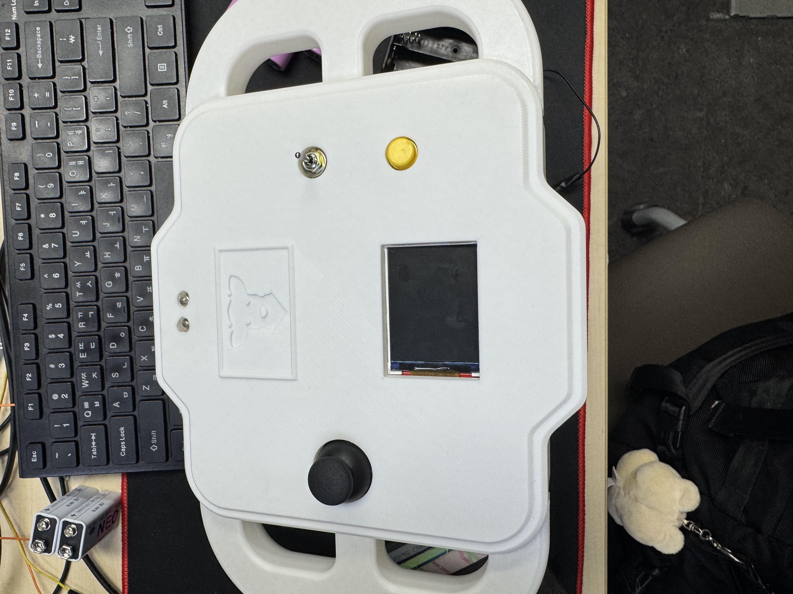
  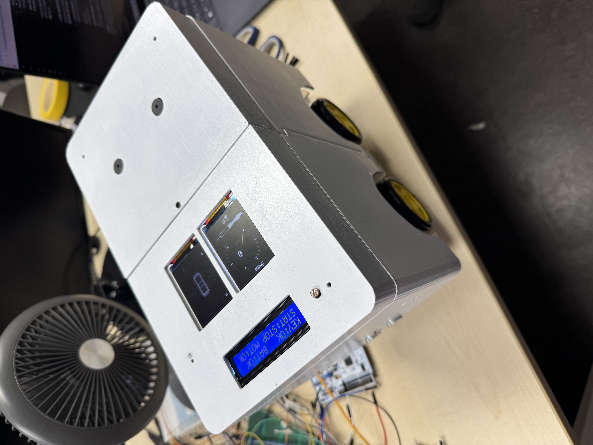
  <br />
  <sub>제작한 Controller와 차량 시스템</sub>
</p>

| 항목 | 내용 |
|---|---|
| Period | 2026.07 |
| Team | 4명 · Controller / Main Node / Sensor Node / Display Node |
| Role | **신동민 — Controller 하드웨어 구성 및 펌웨어 개발** |
| 주요 구현 | RFID 인증·전원 제어, 조이스틱·스위치 입력 처리, Bluetooth 패킷 송신, FSM 설계 |

**Stack**


## 🎬 Demo

**전체 시연 약 2분** · RFID 인증, 경적·방향지시등, 조이스틱 주행 및 차량 센서 연동

<p align="center">
  <a href="https://youtu.be/KFFg7INO1hw">
    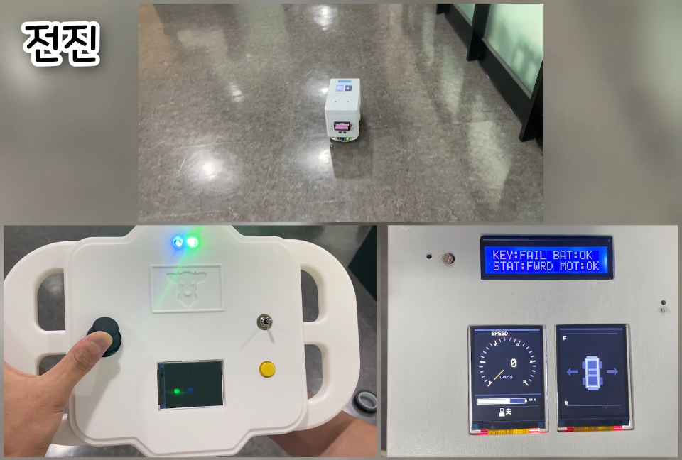
  </a>
  <br />
  <a href="https://youtu.be/KFFg7INO1hw">▶ KICK-CAN 시연 영상 보기 · YouTube</a>
</p>

주요 장면과 구현 설명은 아래에서 확인할 수 있습니다.

<br>

## 🏗️ System Overview

운전자 입력, 차량 구동, 환경 감지, 정보 표시를 네 개 노드로 나누어 차량 전장 시스템을 구성했습니다.

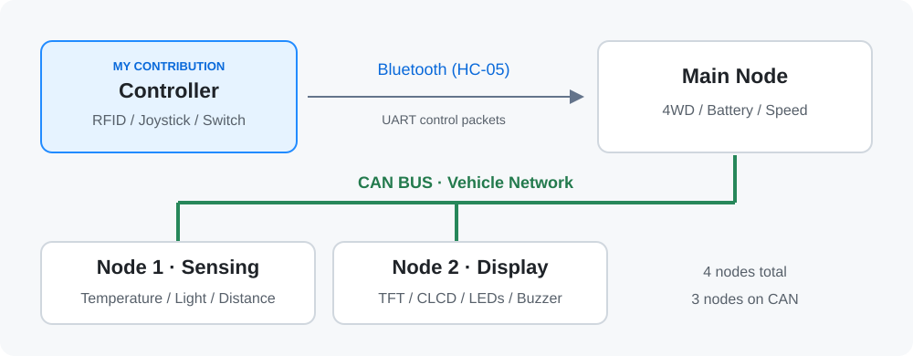

| 노드 | 역할 |
|---|---|
| **Controller · 담당** | RFID 인증, 조이스틱·스위치 입력, Bluetooth 제어 명령 송신 |
| Main Node | 무선 명령 수신, 4WD 모터 구동, 배터리·속도 측정, CAN 연계 |
| Node 1 | 온도·조도·전후방 초음파 센서 처리 및 CAN 메시지 송신 |
| Node 2 | TFT·CLCD 차량 상태 표시, 방향지시등·헤드라이트·부저 제어 |

Controller는 **Bluetooth로 Main Node에 연결**되며, 차량 내부의 세 노드는 **CAN Bus**로 통신합니다.

<details>
<summary>전체 하드웨어 구성도 보기</summary>

**장치 구성 · HSI 1**

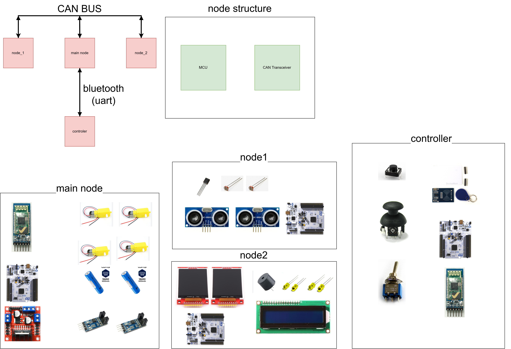

**인터페이스 구성 · HSI 2**

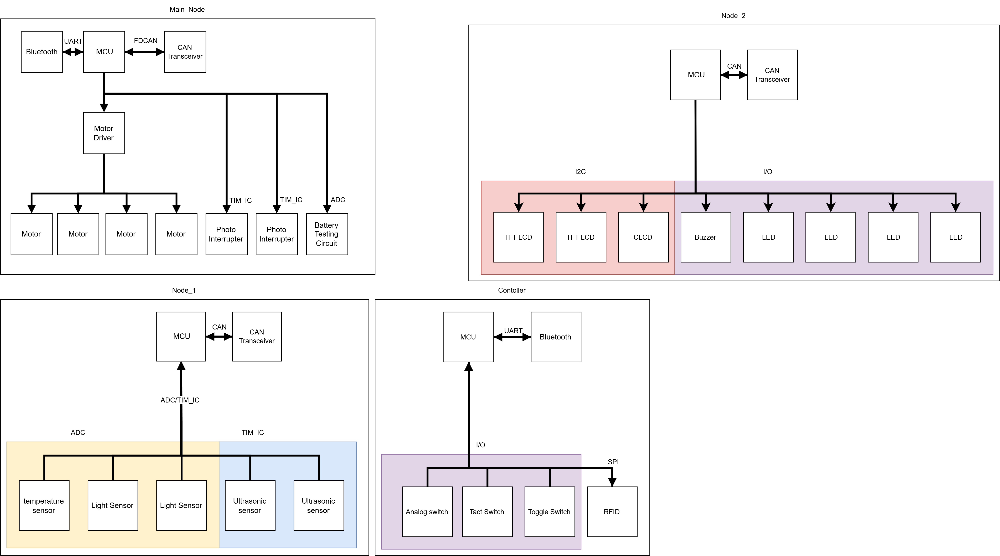

두 이미지는 설계 당시 원본입니다. HSI 2의 TFT 연결은 I2C로 표시되어 있으나, 기능 명세와 HSI 3에서는 SPI로 정의되어 있습니다.

</details>

<br>

## 🧩 My Contribution

사용자 입력이 **인증 → 연결 확인 → 입력 처리 → 패킷 송신**으로 이어지도록 Controller를 구성했습니다.

| 담당 기능 | 구현 내용 |
|---|---|
| RFID 인증·전원 제어 | RC522 UID 판별, 인증 후 릴레이 활성화, 제어 명령 송신 조건 관리 |
| 조이스틱 입력 | ADC Circular DMA로 2축 수집, EMA 필터와 끝값 보정 후 제어 데이터 구성 |
| 스위치 입력 | EXTI 이벤트 전달, Task에서 디바운싱 후 경적·방향지시등 명령 생성 |
| 무선 통신 | 시작·종료 바이트와 XOR 체크섬을 포함한 12바이트 프레임 송신 |
| FSM·실행 구조 | 인증·연결 상태 전이 설계, RFID·Joystick·Control Task 분리, UART Mutex 적용 |

<br>

## ⚙️ Key Implementation

### 1. FSM 기반 인증·연결·제어 상태 관리

`LOCKED → WAIT_BT → ACTIVE` 순서로 제어를 활성화합니다. 등록 카드 인증만으로 바로 송신하지 않고, Bluetooth 연결과 인증 메시지 송신까지 확인한 뒤 주행 명령을 허용합니다.

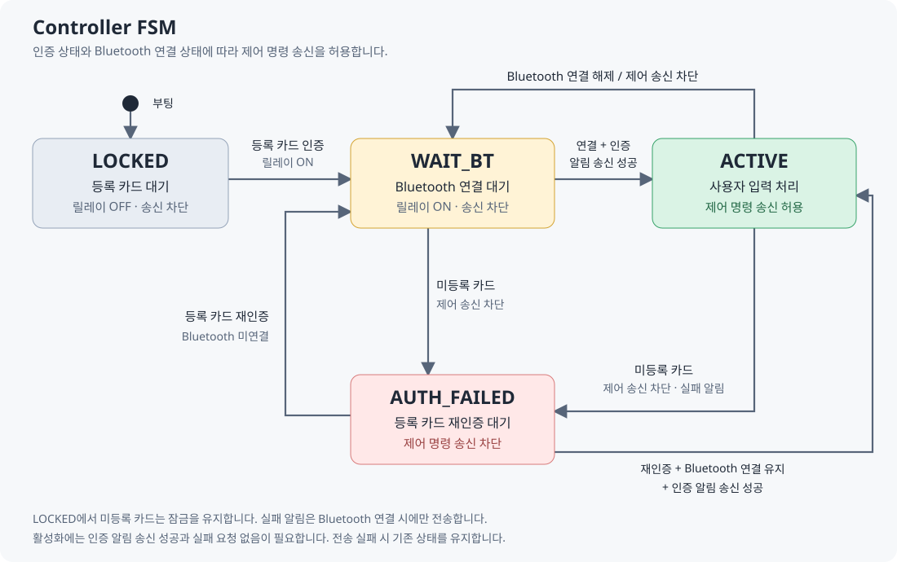

RFID와 Bluetooth에서 발생한 이벤트를 `ControlTask`로 모으고, 상태 전이는 `System_Manager`에서 관리합니다. 입력 모듈은 `System_CanControl()`을 통해 제어 가능 여부를 확인하도록 역할을 나누었습니다.

- 부팅 시 릴레이를 끄고 제어 명령 송신을 차단합니다.
- 등록 카드 인증 후 릴레이를 켜고 Bluetooth 연결을 기다립니다.
- 연결이 끊기면 `WAIT_BT`로 전환해 제어 명령 송신을 차단합니다.
- 동작 중 미등록 카드를 인식하면 `AUTH_FAILED`로 전환합니다. Bluetooth가 연결되어 있으면 인증 실패를 알리고, 재인증을 기다립니다.

| 인증 성공 | 인증 실패 |
|---|---|
| 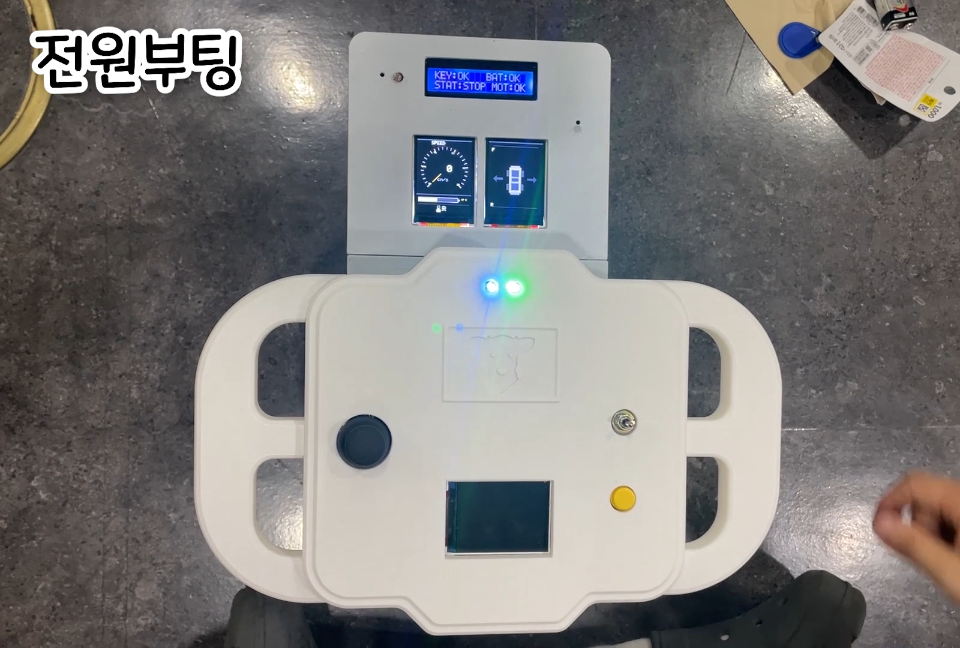 | 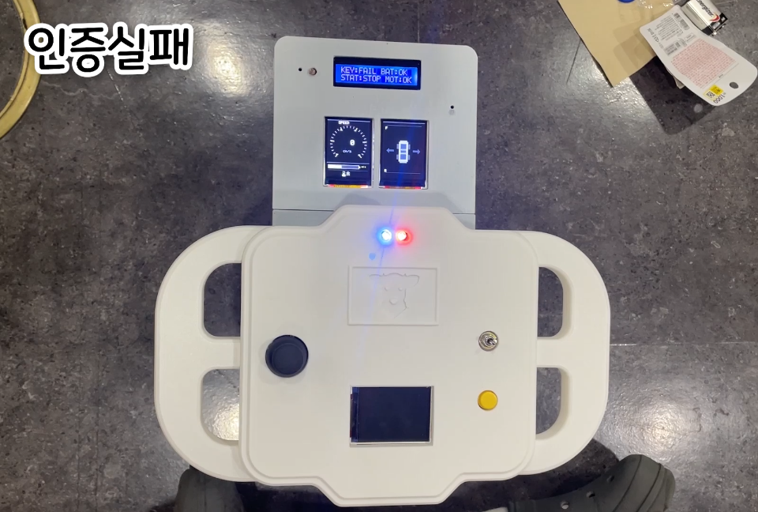 |
| Controller의 상태 LED와 차량의 `KEY:OK` 표시 | Controller의 상태 LED와 차량의 `KEY:FAIL` 표시 |

[관련 코드: System_Manager.c](https://github.com/Dongmins11/KickCAN_project_Controller/blob/main/My_main/SYSTEM/System_Manager.c)

<br>

### 2. ADC DMA와 필터를 이용한 조이스틱 입력 처리

10-bit ADC의 두 채널을 Circular DMA로 수집하고, **EMA 필터 → 끝값 보정 → 제어 프레임 구성** 순서로 처리합니다. 미세하게 변하는 아날로그 값을 그대로 전송하지 않도록 필터를 적용했습니다.

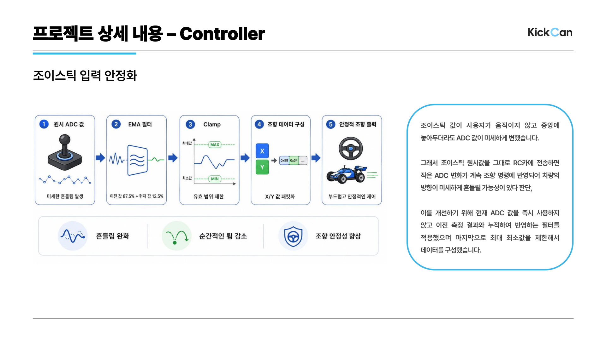

<p align="center">
  
  <br />
  <sub>01:41 · 조이스틱 조작, RC카 주행, 차량 표시부를 함께 보여주는 장면</sub>
</p>

[관련 코드: Joystick.c](https://github.com/Dongmins11/KickCAN_project_Controller/blob/main/My_main/SWITCH/Joystick.c)

<br>

### 3. 이벤트 처리와 UART 공유 자원 관리

스위치 인터럽트에서는 Thread Flag만 전달하고, `ControlTask`에서 디바운싱과 명령 생성을 처리합니다. RFID 처리와 조이스틱 처리를 별도 Task로 나누고, 공통 송신 함수에서는 **UART Mutex**로 프레임이 서로 섞이지 않도록 접근을 제어합니다.

송신 직전에도 제어 가능 상태를 다시 확인하여, 인증 실패나 연결 상태 변경 이후 주행·스위치 명령이 계속 나가지 않도록 구성했습니다.

| 경적 버튼 입력 | 방향지시등 입력 |
|---|---|
| 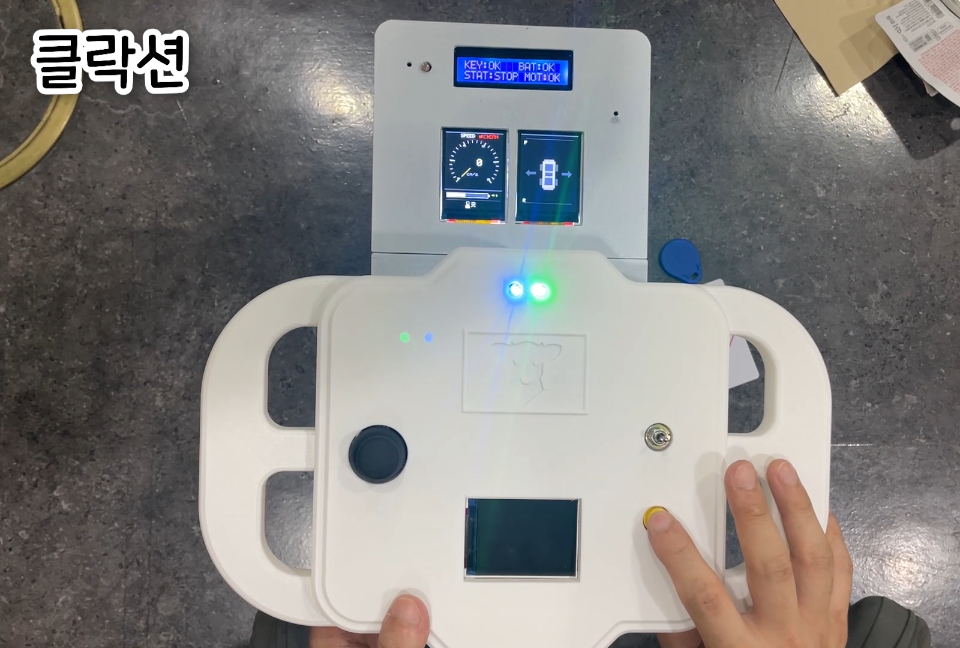 | 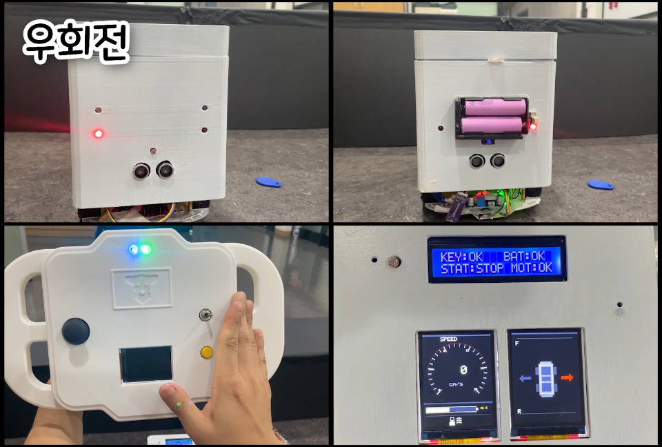 |
| 택트 스위치 입력을 경적 명령으로 전송 | 토글 입력을 차량의 방향지시등·표시부와 연계 |

[Task 구성](https://github.com/Dongmins11/KickCAN_project_Controller/blob/main/Core/Src/freertos.c) · [공통 송신 코드](https://github.com/Dongmins11/KickCAN_project_Controller/blob/main/My_main/BTCOM/Bt_Com.c)

<br>

## 🔧 Troubleshooting

### Bluetooth 통신 안정화 및 수신율 개선

**문제:** UART 수신 프레임의 경계가 밀리고 불필요한 데이터가 섞여, 차량에서 제어 명령을 정상적으로 해석하지 못하는 현상이 발생했습니다.

| 개선 단계 | 핵심 대응 |
|---|---|
| 프레임 동기화 | Start/End 바이트로 패킷 경계를 식별하고, 정해진 길이의 프레임을 확보 |
| 무결성 검사 | CheckSum을 활용해서 검사값이 맞지 않는 프레임을 걸러내 잘못된 제어 데이터의 반영 방지 |
| 수신 버퍼 보호 | 수신 측 DMA를 Circular에서 Normal 모드로 변경하고, 처리 중인 데이터가 새 수신 데이터로 덮이지 않도록 수신·처리 흐름 분리 |


제 Controller에서는 **Start/End·XOR 체크섬을 포함한 프레임 생성과 UART Mutex 기반 송신**을 구현했습니다. 위 DMA 수신 처리는 **Main Node 수신 측을 포함한 팀 통합 개선 사례**입니다.

<br>

## 📋 Design Documents

설계에 사용한 엑셀의 주요 내용을 아래 표로 정리했습니다. **요약은 현재 Controller 코드 기준**이며, 원본 파일은 설계 당시 기록으로 함께 제공합니다.

<details>
<summary>🔌 Controller 핀맵 · HSI</summary>

| 장치 / 신호 | MCU 핀 | 인터페이스 |
|---|---|---|
| Joystick X / Y | PA0 / PA1 | ADC1_IN0 / IN1 + DMA |
| RC522 SCK / MISO / MOSI | PA5 / PA6 / PA7 | SPI1 |
| RC522 CS / RST | PA8 / PC7 | GPIO Output |
| HC-05 TX / RX용 MCU 핀 | PA9 / PA10 | USART1_TX / RX |
| HC-05 STATE | PB5 | GPIO EXTI |
| HC-05 EN | PB10 | GPIO Output |
| Relay | PC0 | GPIO Output |
| Horn Switch | PA4 | GPIO EXTI |
| Turn Switch Left / Right | PB0 / PC1 | GPIO EXTI |
| 상태 LED R / G / B | PC8 / PC6 / PC5 | GPIO Output |

[전체 노드 핀맵 표](docs/hsi.md) · [HSI 원본 Excel](docs/files/HSI_3.xlsx)

</details>

<details>
<summary>📡 Controller 송신 명령 · ICD</summary>

모든 명령은 Bluetooth를 통해 Main Node로 전달됩니다. 프레임의 목적지 ID는 무선으로 직접 연결된 장치와 구분되는 논리 목적지입니다.

| 명령 ID | 기능 | 데이터 | 논리 목적지 |
|---|---|---|---|
| 10 | 인증 상태 | 인증 허용·실패 상태 | Node 2 |
| 11 | 주행·조향 | Y 2바이트 + X 2바이트, 각 값 0–1023 | Main Node |
| 12 | 경적 | 스위치 입력 상태 | Node 2 |
| 13 | 방향지시등 | 중앙 0 / 오른쪽 1 / 왼쪽 2 (`NONE` 4) | Node 2 |

```text
Start  | Destination | Command | Data | XOR Checksum | End
0xAA   | 1 byte      | 1 byte  | 7 B  | 1 byte       | 0xFF
```

총 12바이트이며, 체크섬은 앞의 10바이트를 XOR한 값입니다. 조이스틱은 Y, X 순서로 각 축의 상위 바이트부터 기록합니다.

[전체 ICD 표](docs/icd.md) · [ICD 원본 Excel](docs/files/ICD.xlsx)

</details>

<details>
<summary>🧾 기능 명세와 주요 부품 · BOM</summary>

| 기능 ID | Controller 기능 |
|---|---|
| F-CTL-01 | RFID 사용자 인증 |
| F-CTL-02 | 인증 기반 입력 전원 인터락 |
| F-CTL-03 | 조이스틱 주행·조향 데이터 수집 |
| F-CTL-04 | 방향지시등·경적 스위치 입력 처리 |
| F-CTL-05 | 무선 제어 패킷 전송 |

| 주요 부품 | 용도 |
|---|---|
| NUCLEO-F411RE | Controller MCU |
| RC522 | RFID 카드 UID 읽기 |
| HC-05 | Main Node와 Bluetooth 통신 |
| PS2 Joystick | 2축 아날로그 입력 |
| 3단 Toggle / Tact Switch | 방향지시등·경적 입력 |

[전체 기능 명세 표](docs/functions.md) · [전체 BOM 표](docs/bom.md)

[기능 명세 원본 Excel](docs/files/functional-spec.xlsx) · [BOM 원본 Excel](docs/files/BOM.xlsx)

</details>

<br>

## 📁 Source Guide

| 경로 | 역할 |
|---|---|
| `My_main/SYSTEM/` | 인증·연결 상태, 송신 허용 조건, LED 제어 |
| `My_main/RFIDCOM/` | RC522 통신 및 UID 판별 |
| `My_main/SWITCH/` | 조이스틱·토글·택트 입력 처리 |
| `My_main/BTCOM/` | Bluetooth 프레임 구성 및 UART 송신 |
| `My_main/BSW/` | 주변장치 초기화 래퍼 |
| `Core/Src/freertos.c` | Task 생성, 이벤트 처리, UART Mutex 구성 |

[상태·프로토콜 상세와 빌드 안내](docs/controller.md)

## 💬 Retrospective

센서와 통신 기능을 개별적으로 구현하는 것뿐 아니라, 인증 상태와 연결 상태에 따라 입력과 송신을 함께 제어하는 구조를 경험했습니다. 팀원과 제어 명령 규약을 맞추고 실제 차량에 연결하면서, 기능 명세·핀맵·통신 명세가 구현과 일치하도록 관리하는 중요성을 배웠습니다.
